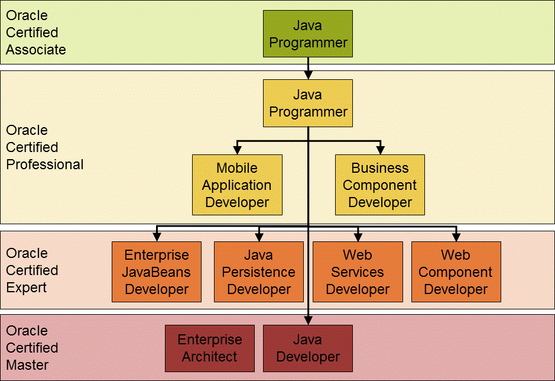

## Oracle Java Certifications

Certification levels:
* Java SE Associate
* Java SE Professional
* Java SE Master
* Java EE Master
* Java EE Certified Expert
* Oracle Certified Master Java Enterprise Architect

List of certification available on <a href="https://education.oracle.com/oracle-certification-paths-all">Oracle.com</a>:
* Java EE and Web Services
    * Oracle Certified Professional, Java EE 7 Application Developer
* Java SE
    * <a href="https://education.oracle.com/product/trackp_333">Oracle Certified Associate, Java SE 8 Programmer</a>
    * <a href="https://education.oracle.com/oracle-certified-professional-java-se-8-programmer/trackp_357">Oracle Certified Professional, Java SE 8 Programmer</a>
    * Oracle Certified Foundations Associate, Java
    * <a href="https://education.oracle.com/products/trackp_OCPJAV11">Oracle Certified Professional: Java SE 11 Developer</a>
    * Oracle Certified Professional: Java SE 17 Developer

#### OCA Oracle Certified Associate, Java SE 8 Programmer, 1Z0-808

Training materials:
- [OCA-Oracle_Certified_Associate_Java_SE_8_Programmer_I_Study_Guide_Exam_1Z0-808.pdf](OCA_Oracle_Certified_Associate_1Z0-808/OCA-Oracle_Certified_Associate_Java_SE_8_Programmer_I_Study_Guide_Exam_1Z0-808.pdf)
- [Oracle_Certified_Associate_Java_SE_7_Programmer_Study_Guide.pdf](OCA_Oracle_Certified_Associate_1Z0-808/Oracle_Certified_Associate_Java_SE_7_Programmer_Study_Guide.pdf)

Other training materials:
- [OCA_Java_SE_8_Programmer_I_Certification_Guide.pdf](OCP_Oracle_Certified_Professional_1Z0-809/OCA_Java_SE_8_Programmer_I_Certification_Guide.pdf)

#### OCP Oracle Certified Professional, Java SE 8 Programmer, 1Z0-809

*
Prior Certification Requirements: Oracle Certified Associate, Java SE 8 Programmer, 1Z0-808
*

Main training materials:
- [OCP_Oracle_Certified_Professional_Java_SE_8_Programmer_II_Study_Guide_Exam_1Z0-809.pdf](OCP_Oracle_Certified_Professional_1Z0-809/OCP_Oracle_Certified_Professional_Java_SE_8_Programmer_II_Study_Guide_Exam_1Z0-809.pdf)
- [Oracle_Certified_Professional_Java_SE_8_Programmer_Exam_1Z0-809.pdf](OCP_Oracle_Certified_Professional_1Z0-809/Oracle_Certified_Professional_Java_SE_8_Programmer_Exam_1Z0-809.pdf)

Other training materials:
- [1Z0-808_exam_questions_examples.pdf](OCP_Oracle_Certified_Professional_1Z0-809/1Z0-808_exam_questions_examples.pdf)
- [A_Programmer’s_Guide_to_Java_SCJP_Certification_Third_Edition.pdf](OCP_Oracle_Certified_Professional_1Z0-809/A_Programmer’s_Guide_to_Java_SCJP_Certification_Third_Edition.pdf)
- [OCP_Java_SE_6_Programmer_Practice_Exams_Exam_310-065.pdf](OCP_Oracle_Certified_Professional_1Z0-809/OCP_Java_SE_6_Programmer_Practice_Exams_Exam_310-065.pdf)
- [Oracle_Certified_Java_SE_8_Programmer_I_Certification_Guide.pdf](OCP_Oracle_Certified_Professional_1Z0-809/Oracle_Certified_Java_SE_8_Programmer_I_Certification_Guide.pdf)

Articles:
- [Best Java Certifications Online, https://hackr.io](https://hackr.io/blog/java-certification-courses)

Material sources:
- [Java-Training-2018, PDF Books, GitHub](https://github.com/gopinathankm/Java-Training-2018)

#### Oracle Certified Master Java Enterprise Architect

Training materials:
- [McGraw Hill SCEA Sun Certified Enterprise Architect for Java EE Study Guide Exam.310-051.Jul.2007](Oracle_Certified_Master_Java_Enterprise_Architect/McGraw.Hill.SCEA.Sun.Certified.Enterprise.Architect.for.Java.EE.Study.Guide.Exam.310-051.Jul.2007.pdf)

Articles:
- TBD

Material sources:
- [How to prepare Oracle Certified Master Java EE Enterprise Architect (1z0-807, 1Z0-865, 1Z0-866) - OCMJEA6 Exam, www.java67.com](https://www.java67.com/2020/06/how-to-prepare-oracle-certified-master-java-ee-architect-certification-exam.html)
