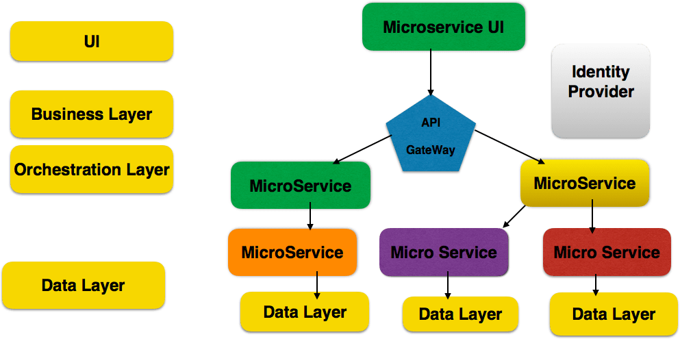

# Microservices

Developers need to have an understanding of Docker Container. Docker is used for creating and compiling microservices applications in different environments. Developers need to know DURS principles which are the basis for Microservices.

DURS  principles are:
* Domain-Driven Design
* Failure Isolation
* Continuous Delivery
* Decentralization
* DevOps
